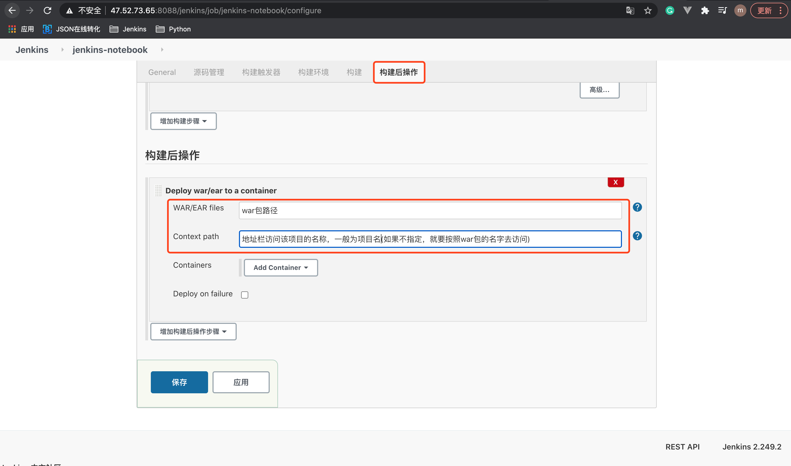
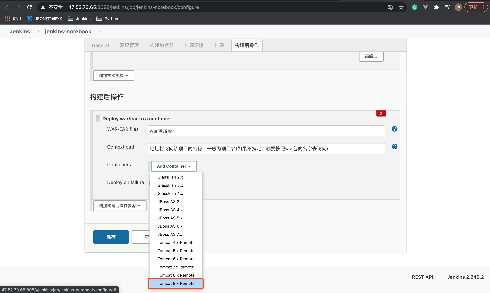
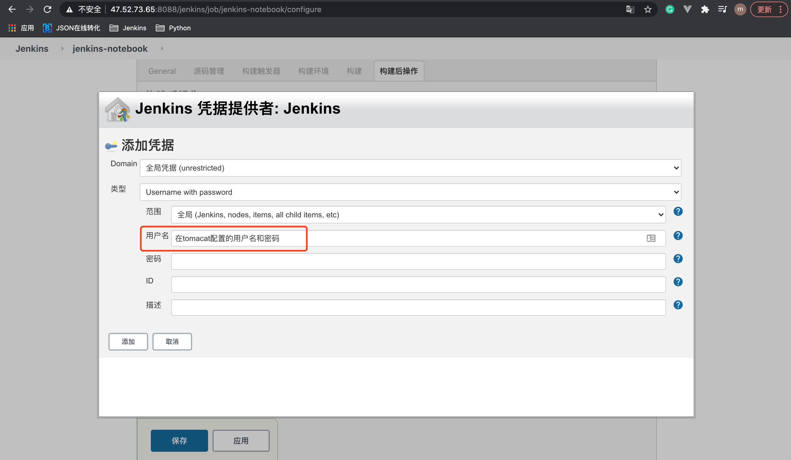
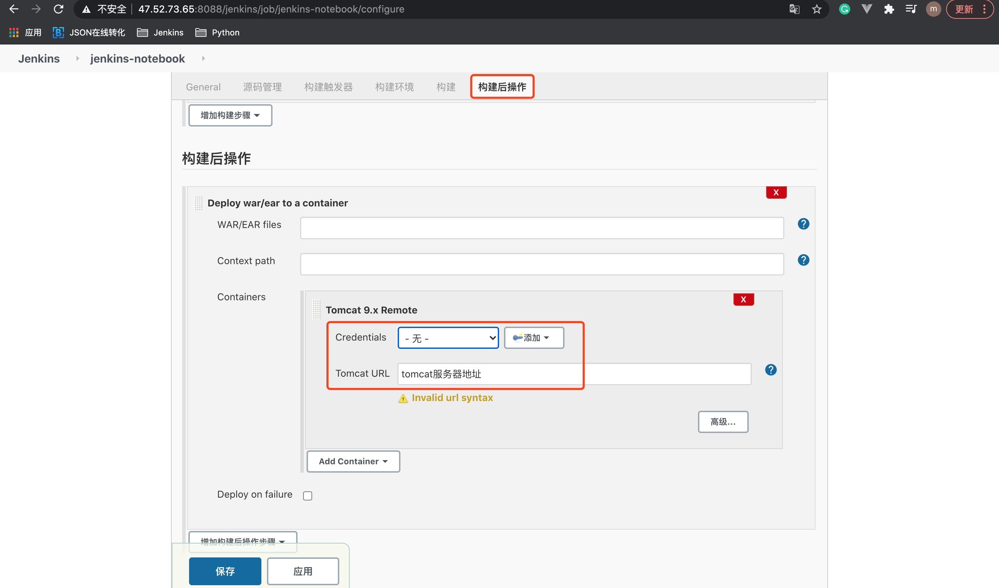

# 10. 配置构建后部署等操作

在构建后，需要将项目打包并部署到服务器中，如Java的war包。

## 10.1 Java项目
### 配置war包的 WAR files 和 Context path    

### 配置war包的Container

* 打包好的war包，会部署到 服务器tomcat路径/webapps/项目名.war
* 打包好的war包在服务器的 webapps路径下，还会有1个解压后的文件夹，名字为 Context path

配置tomcat的凭证

配置tomcat服务器地址

`注意`: 可以配置多个Container，部署到不同的服务器
