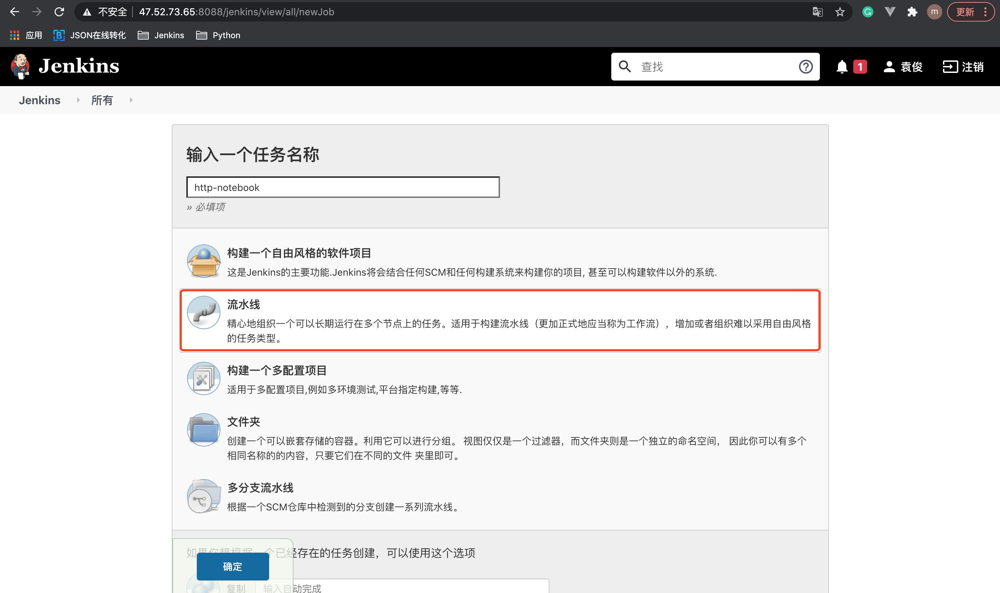
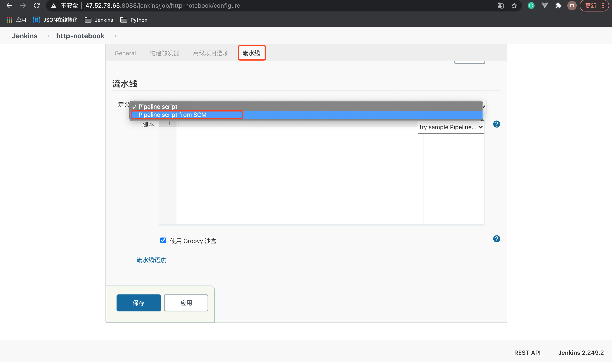
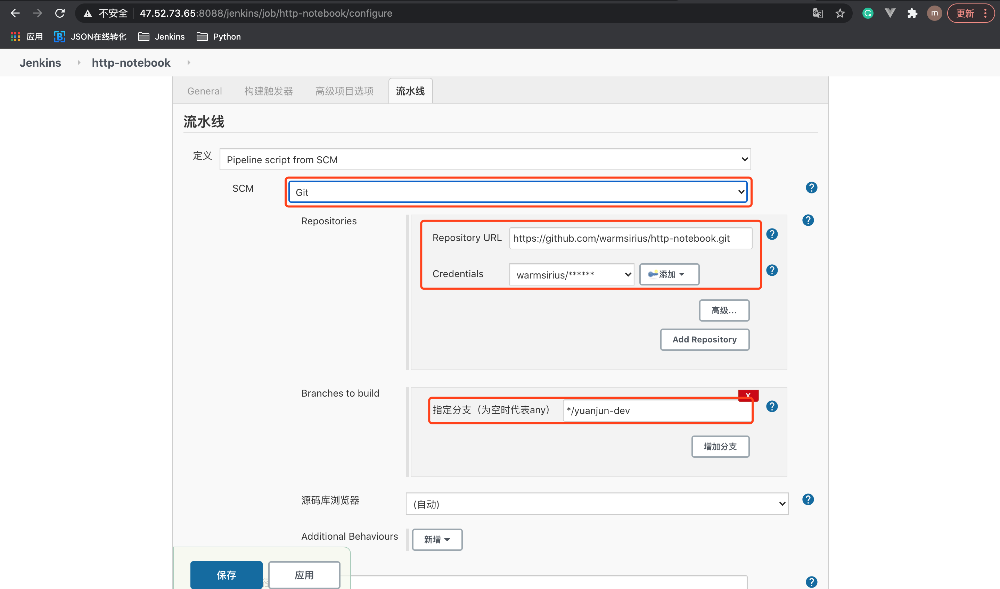
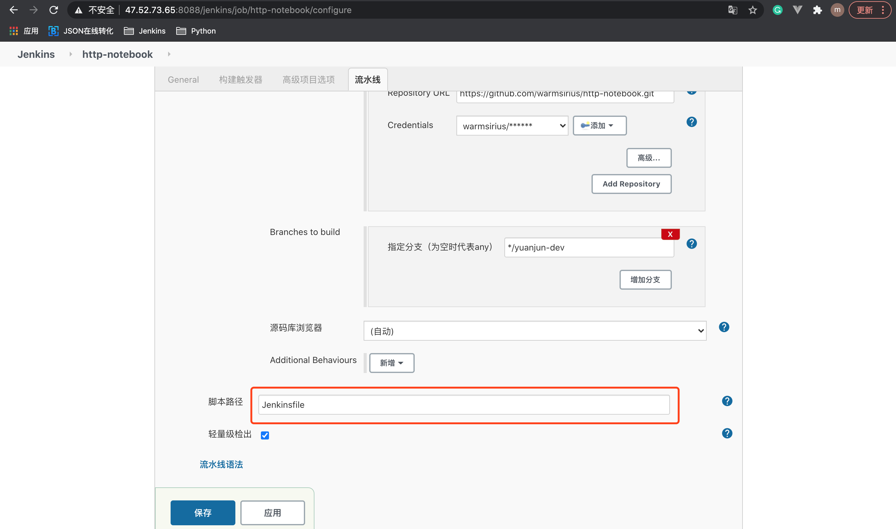
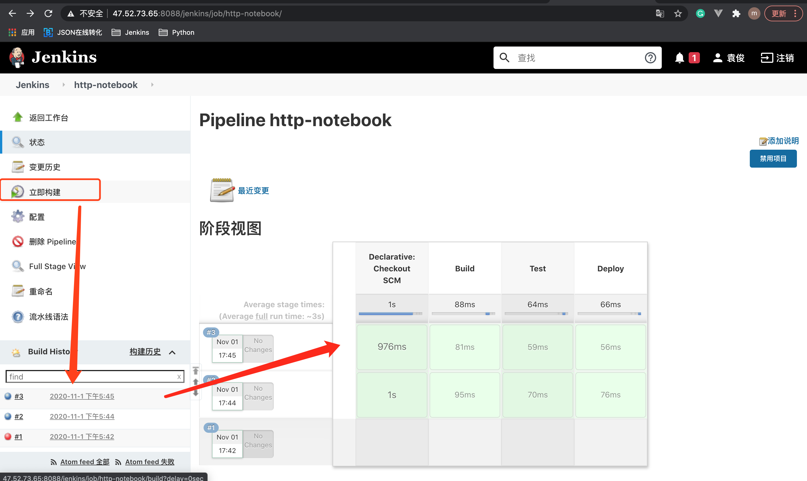

# 6. pipeline构建拉取 GitHub仓库

## 6.1 创建 Jenkins任务

创建1个http-notebook的任务

* 选择 pipleline(流水线)




## 6.2 配置流水线

1.点击 【配置】:
* 选择 Pipeline script for SCM




2.配置 Git SCM
* 配置 Repository URL 及 Credentials
* 设置 Branches to build，选择要构建的分支



`注意`: Branches to Build 一定要填写，不能为空，pipeline可理解为git单分支构建。

3.pipeline构建脚本路径



`说明`: 该脚本路径基于项目的目录，默认都是Jenkinsfile，也可自行配置。


## 6.3 项目编写 Jenkinsfile
1.对http-notebook项目 Jenkinsfile内容如下:

```groovy
pipeline {
    agent any

    stages {
        stage('Build') {
            steps {
                echo 'Building'
            }
        }

        stage('Test') {
           steps {
            echo 'Testing'
           }
        }

        stage('Deploy') {
            steps {
                echo 'Deploying'
            }
        }
    }
}
```

## 6.4 测试配置是否成功

在Jenkins项目中，构建该项目，查看构建结果。


