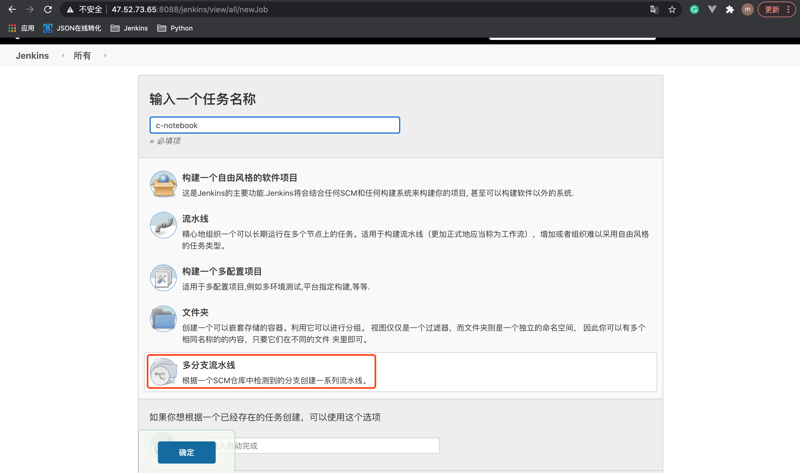
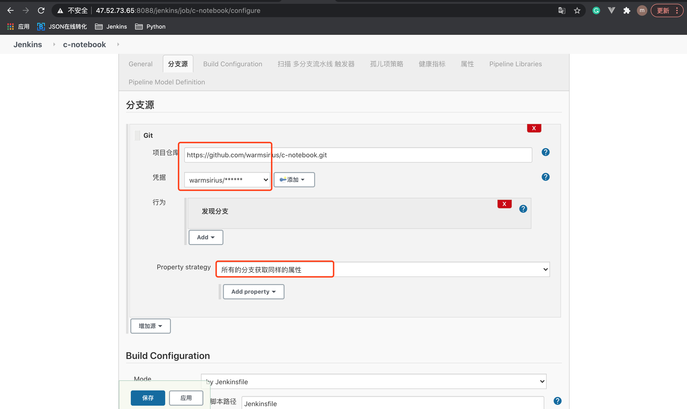
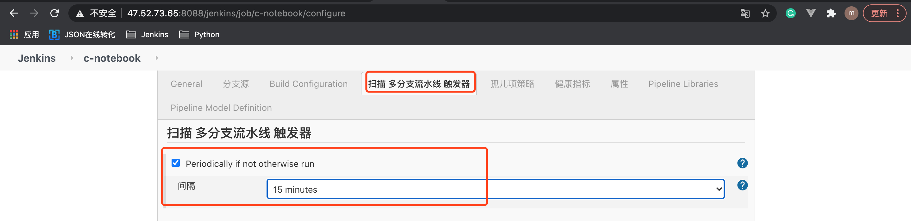
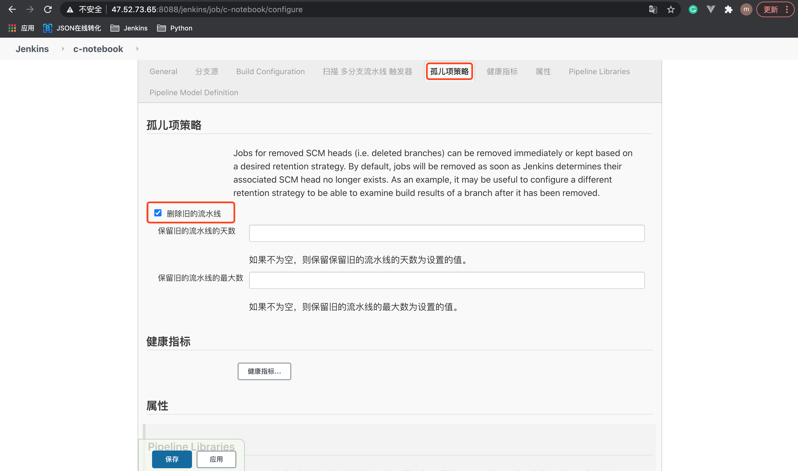

# 8. 多分支 pipeline构建

## 8.1 创建多分支项目




## 8.2 设置代码仓库地址




## 8.3 设置分支扫描触发策略

分支扫描: 指 Jenkins 根据一定的策略去代码仓库扫描分支，如果有新分支就创建1个以新分支命名的任务，如果发现有分支删除了，就删除相应的Jenkins任务。




## 8.4 设置孤儿任务处理策略

孤儿任务: 如果代码仓库中的分支删除了，而Jenkins上的相应任务没有被删除，这种任务称为孤儿任务。





## 8.5 pipeline when指令实现根据分支部署到不同环境

```
pipeline {
    agent any

    stages {
        stage('deploy to test'){
            when {
                branch 'master'
            }
            steps {
                echo "deploy to test"
            }
        }
        
        stage('deploy to prod'){
            when {
                branch 'release'
            }
            steps {
                echo "deploy to prod"
            }
        }
    }
}
```

## 8.5 Generic Webhook Trigger插件在多分支pipeline场景的应用

如果希望触发某个分支的构建执行，GenericTrigger 传参如下:

```
triggers {
    GenericTrigger(
        genericVariables: [
            [key: 'ref', value: '$.ref']
        ]
        
        token: env.JOB_NAME,
        
        regexFilterText: '$ref',
        
        regexFilterExpression: 'refs/heads/' + env.BRANCH_NAME
    )
}
```


