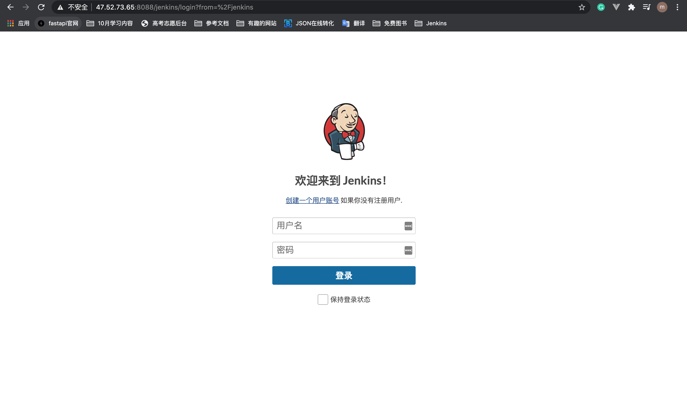

# 4. 安装Jenkins并启动

## 4.1 下载Jenkins

```
wget http://mirrors.jenkins.io/war-stable/latest/jenkins.war
```

## 4.2 启动Jenkins

1.将下载的 jenkins.war 移动到Tomcat解压目录: /webapps 目录下。

2.打开 tomcat9 下的 opt/tomcat9conf/server.xml 修改URL地址的编码解码字符集

```
    <Connector protocol="AJP/1.3"
               address="::1"
               port="8009"
               redirectPort="8443" URIEncoding="UTF-8"/>
```

启动Tomcat:

```
cd /opt/tomcat9/bin
./startup.sh 
```

浏览器访问:

http://47.52.73.65:8088/jenkins

得到如下界面:




