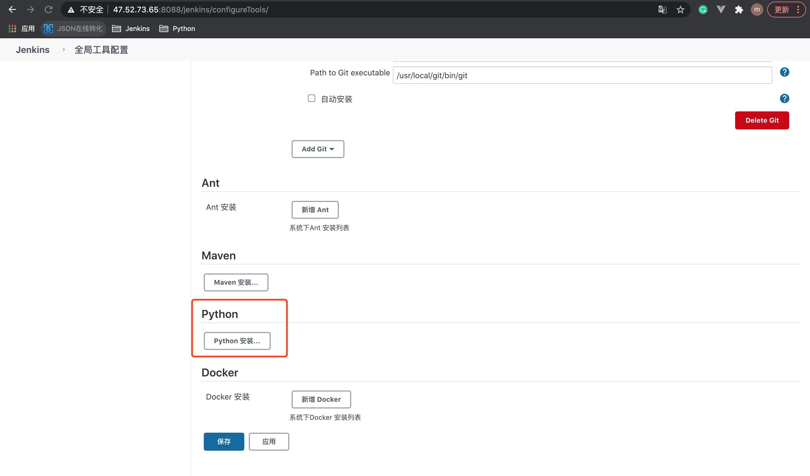
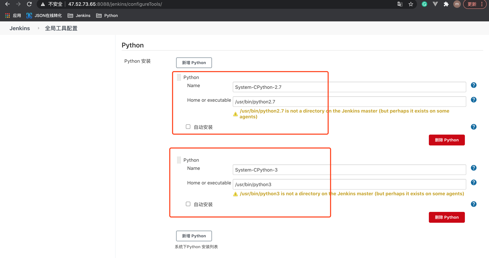

# 1. Python环境搭建

## 1.1 Jenkins机器环境依赖

* 已安装 Python
* 已安装 pip
* 已安装 virtualenv

## 1.2 Jenkins 下载插件

* Shining Panda: 将 Python环境 加入 全局工具变量
* Pyenv pipeline: 工程级别环境隔离

## 1.3 配置 Python 环境

1.点击 【全局工具配置】

2.使用which python指令，配置python2.7 和 python3 的路径

