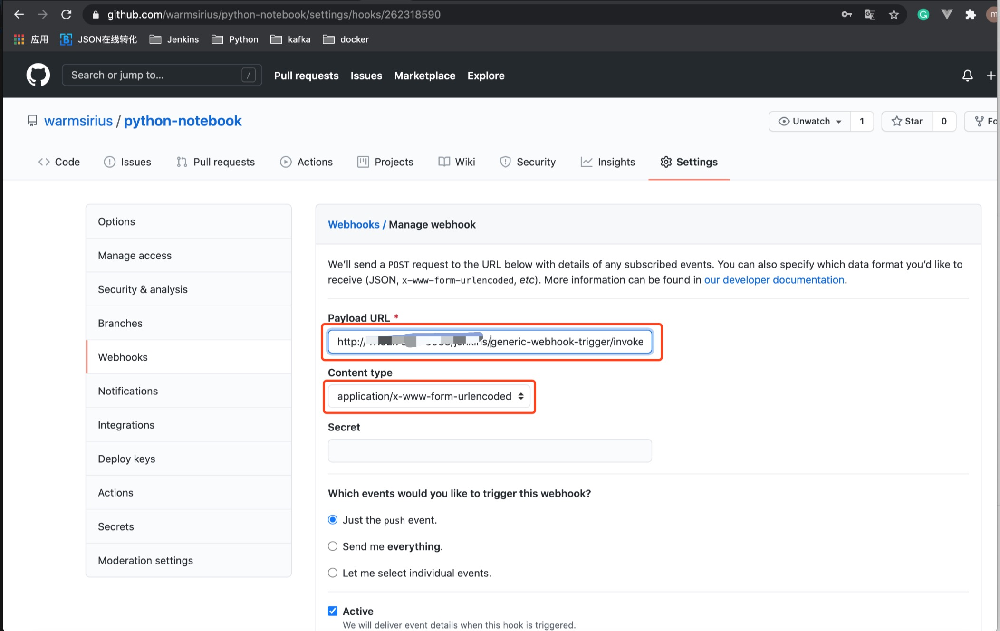

# 10. Generic Webhook Trigger 构建触发

当每一次提交代码到 Github/GitLab/Gitee 的时候，Github/GitLab/Gitee 会帮我们发送一个关于Push的Post请求到我们的Jenkins服务器，然后Jenkins持续集成插件Generic Webhook Trigger会接收到请求的参数。

## 10.1 Git Push 的POST数据格式

GitLab提交POST body参数如下:

* ref: 表示当前的分支名，一般为 refs/heads/分支名，一般Github等其他的都是统一 ref 字段表示分支名。

```
{
    "before": "fb32ef5812dc132ece716a05c50c7531c6dc1b4d", 
    "after": "ac63b9ba95191a1bf79d60bc262851a66c12cda1", 
    "ref": "refs/heads/commit的分支名", 
    "user_name": "123", 
    "user": {
        "email": "gitlab邮箱", 
        "name": "gitlab用户名", 
        "time": "2016-12-09T17:28:02 08:00"
    }, 
    "repository": {
        "name": "webhook", 
        "url": "http://git.oschina.net/oschina/webhook", 
        "description": "", 
        "homepage": "http://git.oschina.net/oschina/webhook"
    }, 
    "commits": [
        {
            "id": "ac63b9ba95191a1bf79d60bc262851a66c12cda1", 
            "message": "1234 bug fix", 
            "timestamp": "2016-12-09T17:28:02 08:00", 
            "url": "http://git.oschina.net/oschina/webhook/commit/ac63b9ba95191a1bf79d60bc262851a66c12cda1", 
            "author": {
                "name": "github名字", 
                "email": "github邮箱", 
                "time": "2016-12-09T17:28:02 08:00"
            }
        }
    ], 
    "total_commits_count": 1, 
    "commits_more_than_ten": false, 
    "project": {
        "name": "webhook", 
        "path": "webhook", 
        "url": "http://git.oschina.net/oschina/webhook", 
        "git_ssh_url": "git@git.oschina.net:oschina/webhook.git", 
        "git_http_url": "https://git.oschina.net/oschina/webhook.git", 
        "git_svn_url": "svn://git.oschina.net/oschina/webhook", 
        "namespace": "oschina", 
        "path_with_namespace": "oschina/webhook", 
        "default_branch": "master"
    }, 
    "hook_name": "push_hooks", 
    "password": "pwd"
}
```


## 10.2 GWT Jenkinsfile 实现指定分支构建触发

* $.ref: 从body中取 ref 的值
* token: 必须传这个参数

`注意`: 如果不传递 token，webhook设置后，请求会报 404，因为无法指定是哪个 job。


```
pipeline {
    agent any
    
    triggers {
        GenericTrigger(
            genericVariables: [
                [key: 'ref', value: '$.ref']
            ],
            token: 设置触发的TOKEN值,
            regexFilterText: '$ref',
            regexFilterExpression: '/ref/heads/(yuanjun-dev|test)'
        )
    }
}
```


## 10.3 GitHub的 webhook 设置

### GWT的触发地址
 
**JENKINS_URL/generic-webhook-trigger/invoke?token=TOKEN**

### Github 中webhook设置




