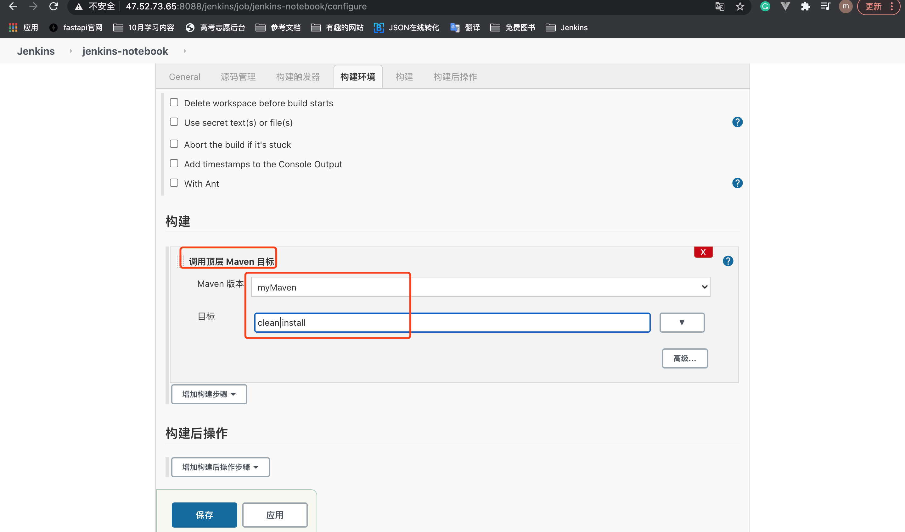
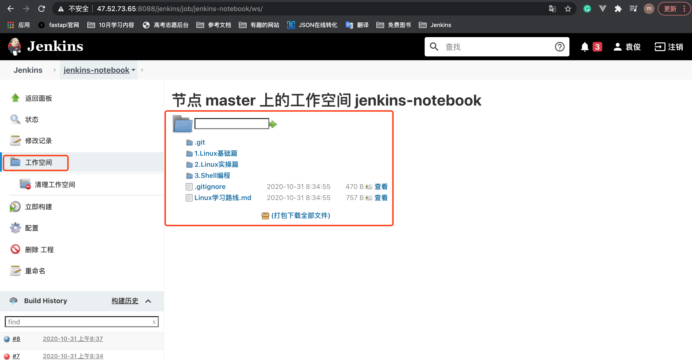

# 9. 配置构建

配置好源码后，还不能直接构建项目，需要对项目配置好构建后，才能构建项目。

## 9.1 Java项目构建
* 选择调用顶层Maven目标
* Maven版本: MyMaven
* 目标: clean install



## 9.2 Python项目构建
* 选择调用shell
* 输入要构建时执行的shell脚本
```
cd /root/.jenkins/workspace/jenkins-notebook
```
`注意`: 本次jenkins-notebook只是一些文档，所以shell就简单一句。


关于Jenkins默认项目的路径参见另一篇笔记。


## 9.3 查看项目的工作空间



`注意`: 对于Java程序，工作空间在maven构建后会有1个war包。
