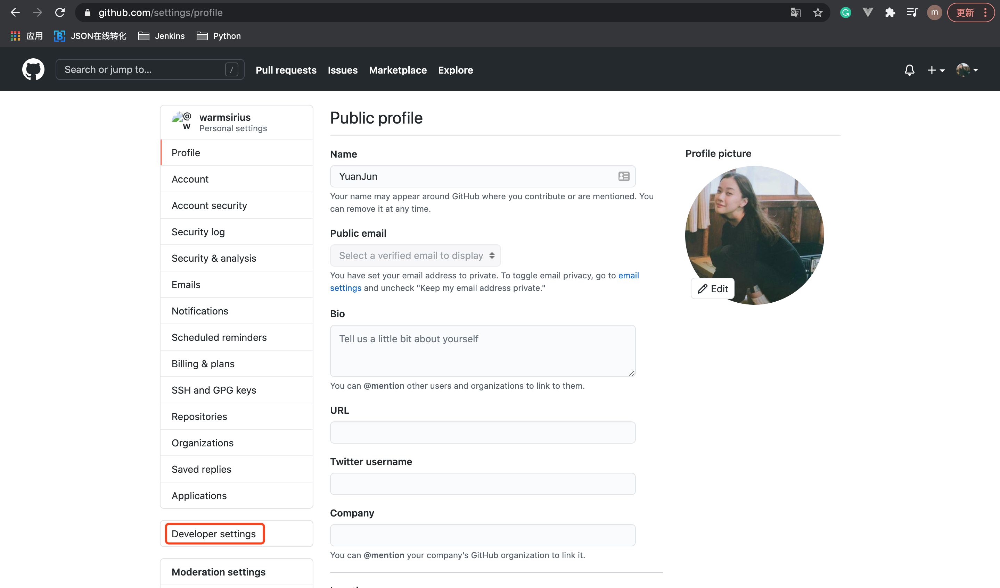
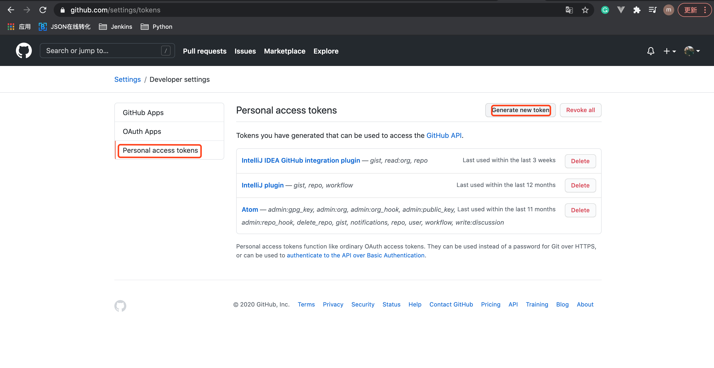
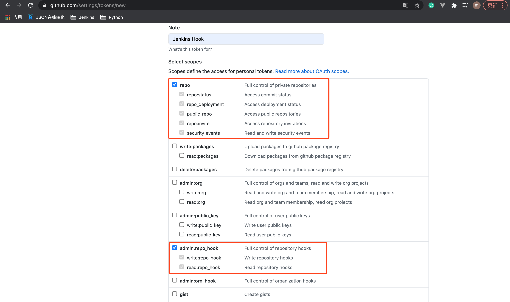
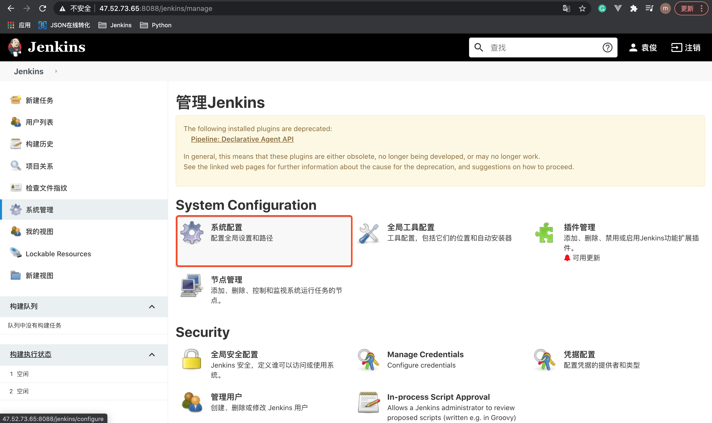
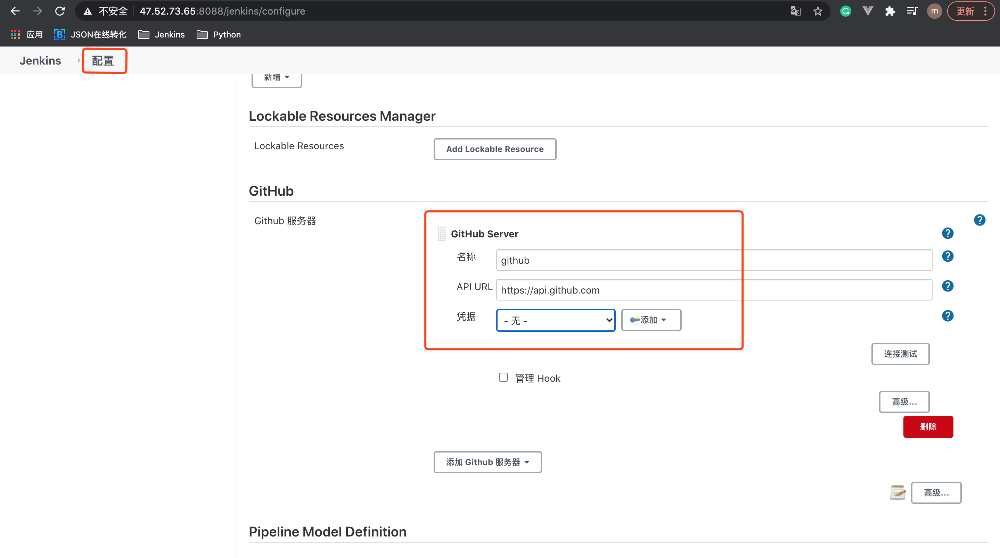
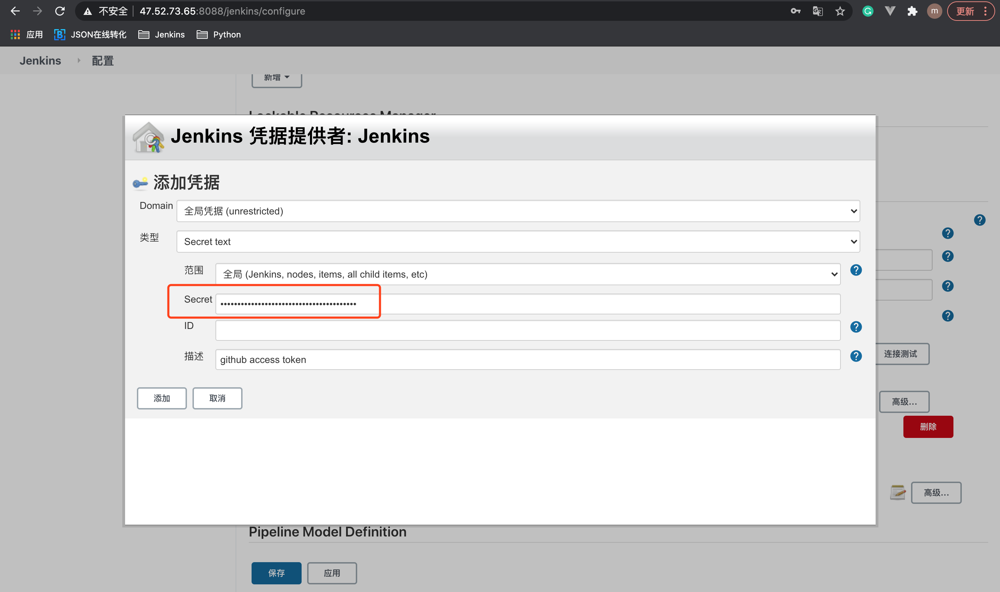
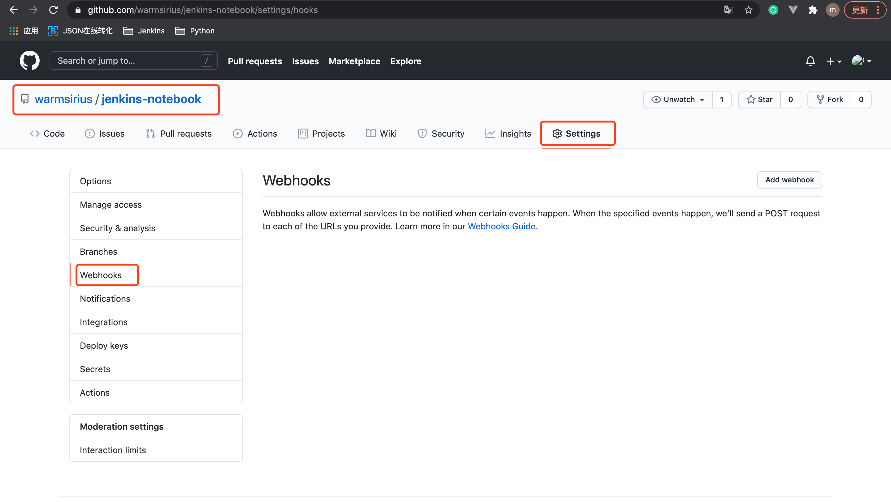
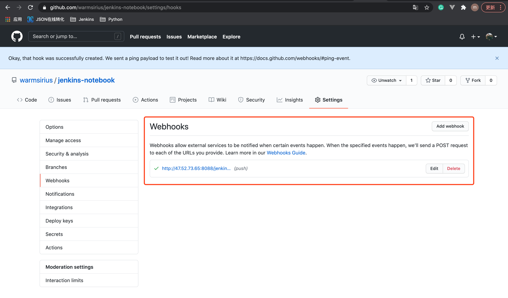
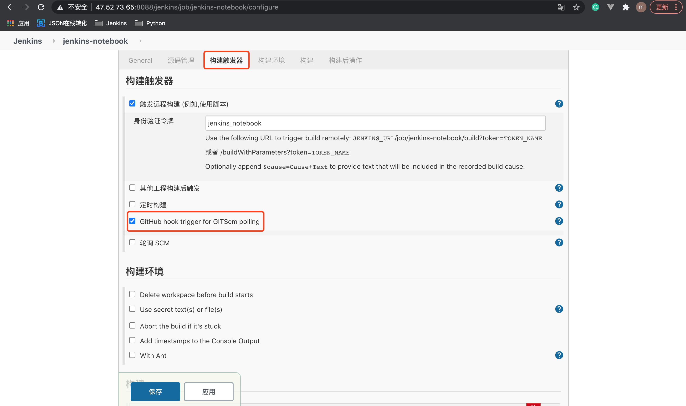
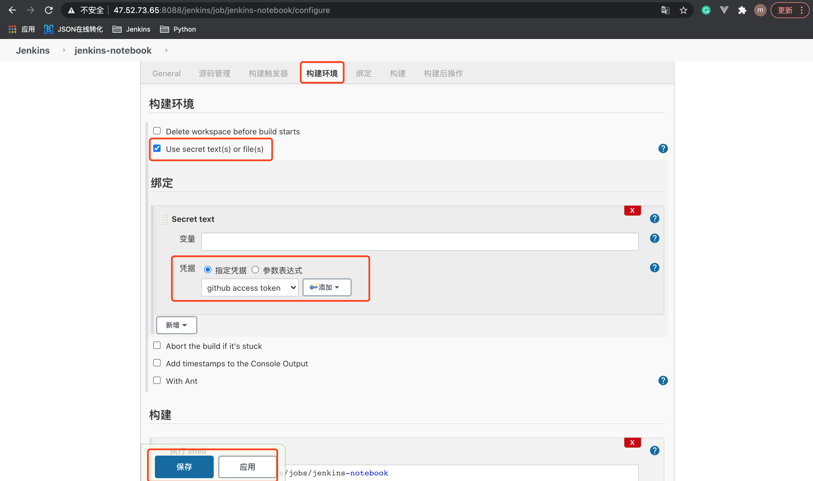

# 12. Github+Jenkins 配置 WebHook

## 12.1 GitHub 设置 TOKEN

1.进入 GitHub 账号，选择 Settings，选择 Developer settings

2.设置 Personal Access Token

名字为: Jenkins Hook

3.选择 Jenkins Hook 使用TOKEN的权限范围

4.将生成的 Jenkins Hook 的 token值记录下来。

## 12.3 Jenkins 配置 GitHub Server

1.进入Jenkins，选择 系统配置

2.选择 Github 服务器
* API URL固定: https://api.github.com
* 名称随意

3.配置凭据:
* 选择 Secret text
* 将 Jenkins Hook的token复制进去

## 12.3 GiHub 项目配置 WebHook

1.进入GitHub项目，选择 settings 下的 webhook

2.添加webhook 的 Payload URL

* Payload URL: JENKINS_URL/github-webhook/

`注意`: Payload URL的github-webhook后必须带有 / 。

3.添加成功后的webhook

`注意`: 添加成功后，要检查上面界面的 Payload URL 是不是绿色的✔️，如果是，则表明没问题了。

## 12.4 Jenkins 项目配置 Github Hook

1. 点击 构建触发器
* ☑️: GitHub hook trigger for GITScm polling

2.点击 构建环境
* ☑️: Use secret text{s} or file{s}

* 添加之前设置的github access token凭据

