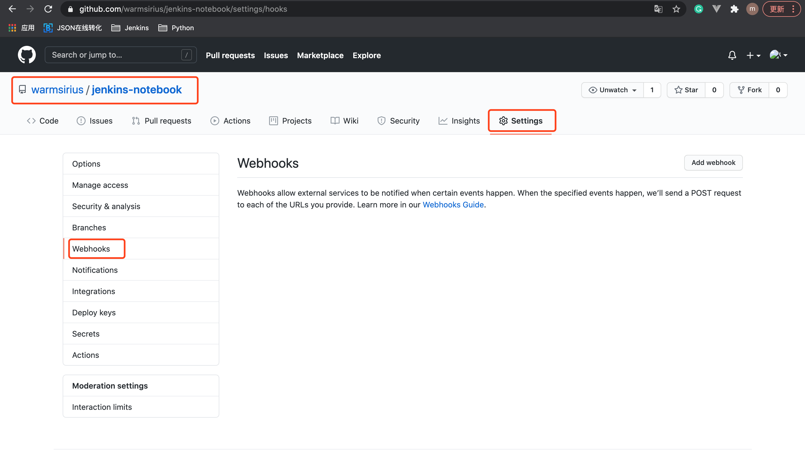
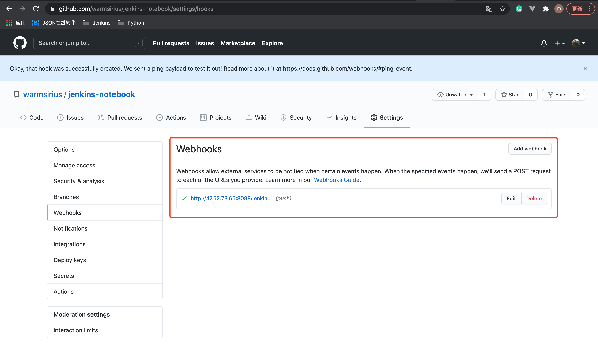

# 7. GitHub项目 配置WebHook远程触发构建

## 7.1 GitHub项目配置 WebHook

1.进入GitHub项目，选择 settings 下的 webhook

2.添加webhook 的 Payload URL

* Payload URL: JENKINS_URL/github-webhook/

`注意`: Payload URL的github-webhook后必须带有 / 。

3.添加成功后的webhook

`注意`: 添加成功后，要检查上面界面的 Payload URL 是不是绿色的✔️，如果是，则表明没问题了。

## 7.2 pipeline 任务点击【构建触发器】

* ☑️: GitHub hook trigger for GITScm polling

